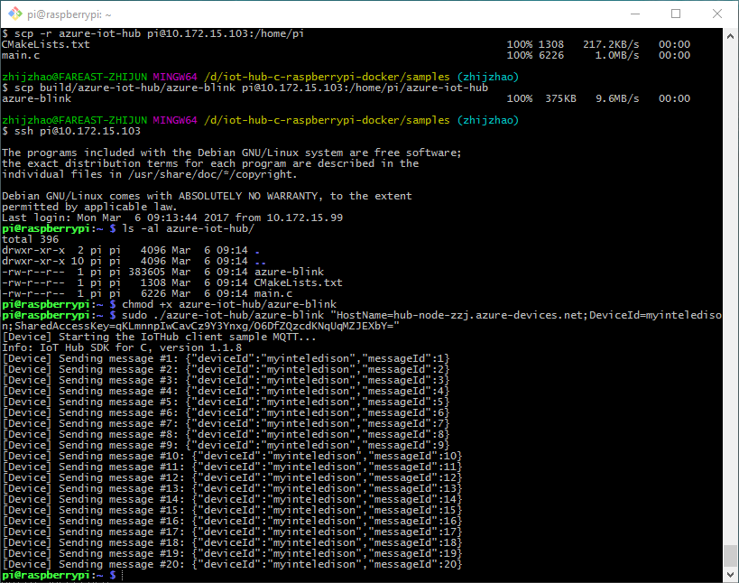

## Send message to Azure IoT hub

The sample code is under `samples/azure-iot-hub` folder.

### Azure IoT hub
If you're curious what Azure IoT Hub is and how to setup and manage Azure IoT Hub, please reference this [tutorial](https://github.com/Azure/azure-iot-device-ecosystem/blob/master/setup_iothub.md) and prepare your own IoT hub and `device connection string`, which is needed by this sample app. 

### Build and deploy

To build and deploy the sample code, simply follow the same steps/commands as we do for `blink` sample. The only difference is the sample folder/app name, which is `azure-iot-hub`/`azure-blink` instead of `blink`.

### Run the app

Follow the same steps as the blink sample. Use SSH to login to Pi device and run the `azure-blink` azure with `device connection string` parameter you prepared earlier.

