## Configure your device

Go to [Configure your device](https://docs.microsoft.com/en-us/azure/iot-hub/iot-hub-raspberry-pi-kit-c-lesson1-configure-your-device) page and setup your Pi for first-time use.

## Get the tools

### Install Git
To install Git, use the [Homebrew](http://brew.sh) package management utility by following these steps:

1. Install Homebrew. If you've already installed Homebrew, go to step 2.
   
   1. Press `Cmd + Space` and enter `Terminal` to open a terminal.
   2. Run the following command:
      
      ```bash
      /usr/bin/ruby -e "$(curl -fsSL https://raw.githubusercontent.com/Homebrew/install/master/install)"
      ```
2. Install Git by running the following command:
   
   ```bash
   brew install git
   ```

### Install Docker
Go to [Docker website](https://www.docker.com/). Scroll down and find the `Get Docker for Mac` link. Click it for download and installation.

## Build C code using Docker

1. Run below command to clone the repo.

   ```bash
   git clone https://github.com/Azure-Samples/iot-hub-c-raspberrypi-docker.git
   ```

2. Press `Cmd + Space` to activate Spotlight Search and search `Docker`. Choose the Docker application and start it.

   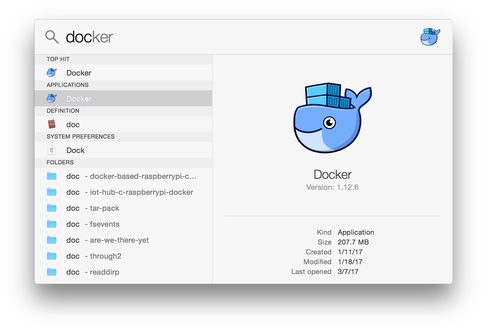

   Make sure Docker is running before executing any Docker command. First try restarting Docker whenever meeting any Docker issues.
   
   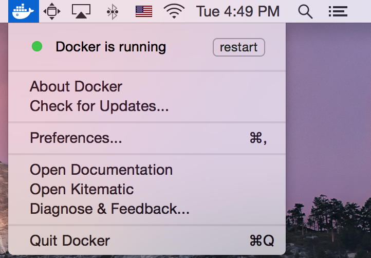

3. Run below commands to do the build.

   ```bash
   docker pull microsoft/iot-hub-c-raspberrypi-build
   ```

   > Below `<>` part needs to be replaced with your own value.

   ```bash
   docker run --rm -v </Users/user-name/some-path/iot-hub-c-raspberrypi-docker/samples>:/repo -it microsoft/iot-hub-c-raspberrypi-build /build.sh --source blink
   ```

   * `--rm` is a Docker running option. For details, please check [Docker reference](https://docs.docker.com/engine/reference/commandline/run/).
   * `</Users/user-name/some-path/iot-hub-c-raspberrypi-docker/samples>` is the full path of sample folder. Replace it with the path on your host machine.
   * `-v` option maps your sample folder to `/repo` folder of the Ubuntu OS running inside Docker container.
   * `-it` option allows you to interact with the running Docker container.
   * `microsoft/iot-hub-c-raspberrypi-build` is Docker image name. Reference `dockerfile` folder if you're interested in how it works.
   * `/build.sh` is the shell script name inside the Ubuntu container. `--source blink` tells `build.sh` that `CMakeList.txt` is under `blink` folder.

   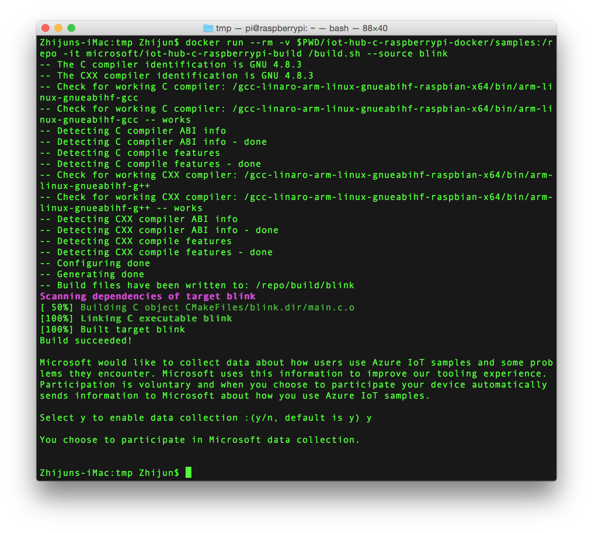

## Deploy and run the built app
1. Use SCP to deploy the built binary and sample code to your Pi's `/home/pi` folder.

  > Below `<>` parts need to be replaced with your own values.

   ```bash
   cd </Users/user-name/some-path/iot-hub-c-raspberrypi-docker/samples>
   scp -r blink <user name>@<device ip address>:/home/pi
   scp build/blink/blink <user name>@<device ip address>:/home/pi/blink
   ```
   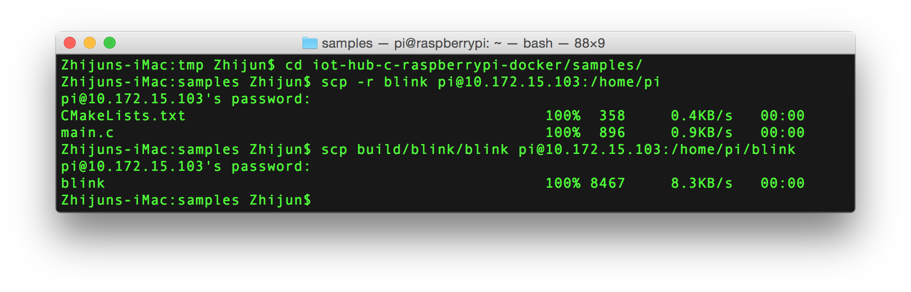

2. Use SSH to login in to the Pi device. Then add executable permission to the built app. Finally, run the app.

   ```bash
   ssh <user name>@<device ip address>
   chmod +x blink/blink
   ./blink/blink
   ```

   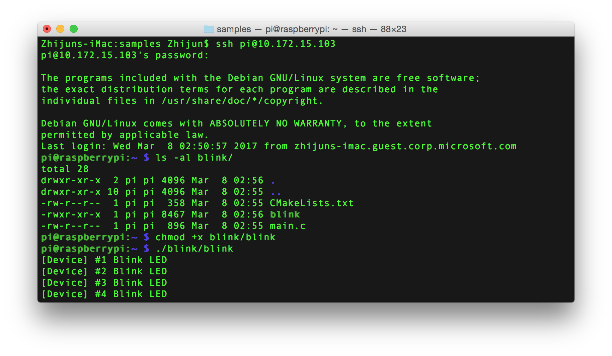

## Debug the app

1. Install Visual Studio Code

   * [Download](https://code.visualstudio.com/docs/setup/osx) and install Visual Studio Code. Visual Studio Code is a lightweight but powerful source code editor.

   * Open VS Code and install extension named `C/C++`. If you have already installed it, please make sure you're using the latest version.

      a. Type `code` command in your Terminal.
      
      b. In VS Code, press `Cmd + P` and type `ext install c/c++` as below.
      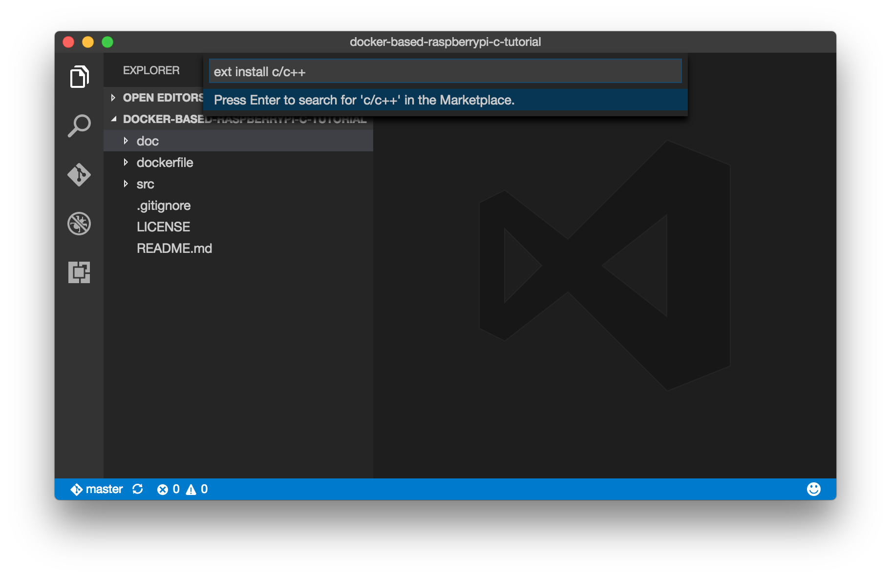
      
      c. Click `Install` to install the extension and reload VS Code as prompted. 
      


2. The `C/C++` extension needs a pipe program to communicate with a remote shell for remote debugging. Here we choose SSH. To avoid password input, we generate SSH key and upload it to Pi. 

   a. Run `ssh-keygen` command in Terminal to generate SSH key.
   
   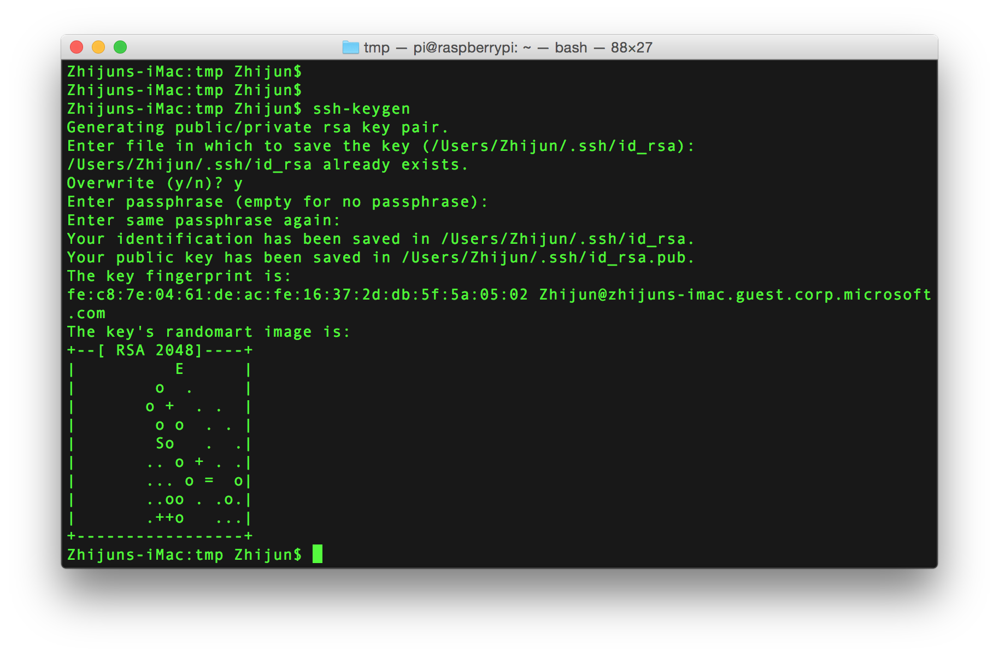

   b. Run `brew install ssh-copy-id` to get the SSH key upload tool.
   
   

   c. Run `ssh-copy-id <user name>@<device IP address>` to upload the SSH key to device.

   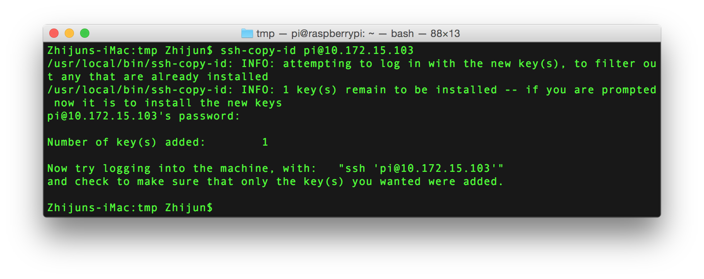

3. Generate `lanuch.json`.

   * Run below command to open `blink` folder.

   ```bash
   code blink
   ```

   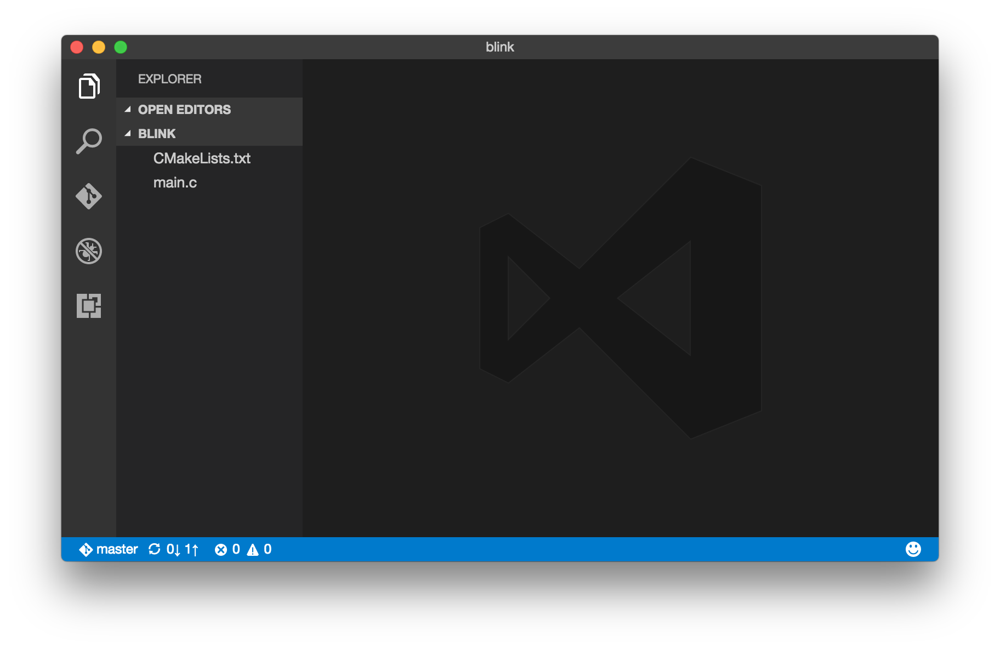

   * Press `F5` key. VS Code will prompt for environment selection.

   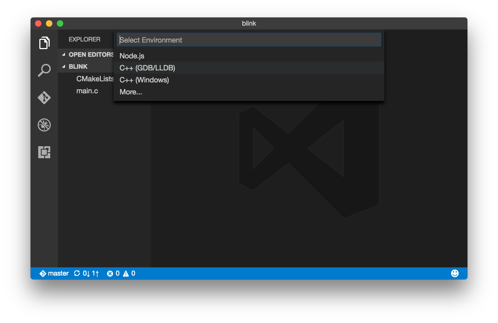

   * Choose `C++(GDB/LLDB)`. `launch.json` is generated automatically.

   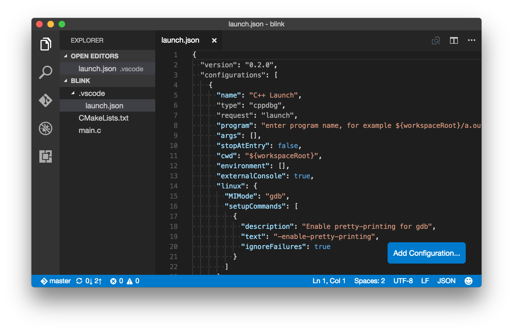

4. Config `launch.json`.

   * `program` is the full path of the deployed app on device. The built binary `blink`, under `build/blink` folder of host machine, is deployed to device's `/home/pi/blink` folder. So the full path value should be `/home/pi/blink/blink`.
 
   * `cwd` is the working folder on device and should be `/home/pi/blink`.

   * `pipeTransport` is for authenticating pipe connection. Paste below properties to `launch.json` and update the user name and IP address accordingly.

      ```
      "pipeTransport": {
            "pipeCwd": "/usr/bin",
            "pipeProgram": "/usr/bin/ssh",
            "pipeArgs": [
                  "<user name>@<device ip address>"
            ],
            "debuggerPath": "/usr/bin/gdb"
      },
      ``` 

   * `sourceFileMap` is for mapping the path of where the code exists on the remote shell to where it is locally. Please add this property and update these two paths accordingly.

      ```
      "sourceFileMap": {
            // "remote": "local"
            "/home/pi/blink": "</Users/user-name/some-path/iot-hub-c-raspberrypi-docker/samples/blink>"
      },
      ```

   * `osx` specifies the debugger, which should be `gdb` instead of `lldb`. Simply replace its value with `Linux`'s.

   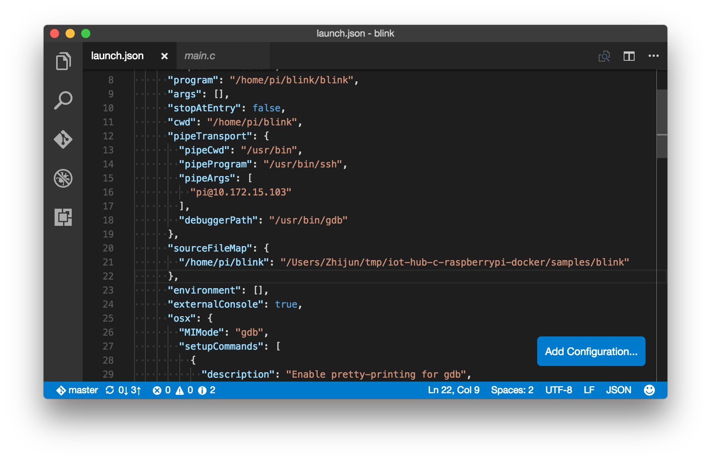

6. Debug `main.c`.

   a. Open `main.c` and insert breakpoints by pressing `F9` key.

   b. Start debugging by pressing `F5` key. Code execution will stop at the breakpoint you set.
   
   c. Press `F10` to debug step by step. Enjoy debugging!

   

## Send message to Azure IoT hub

If you're interested in how to send messages to IoT Hub, please check [Azure IoT Hub](azure-iot-hub-win.md) tutorial.

## Contributing
This project has adopted the [Microsoft Open Source Code of Conduct](https://opensource.microsoft.com/codeofconduct/). For more information see the [Code of Conduct FAQ](https://opensource.microsoft.com/codeofconduct/faq/) or contact [opencode@microsoft.com](mailto:opencode@microsoft.com) with any additional questions or comments.
