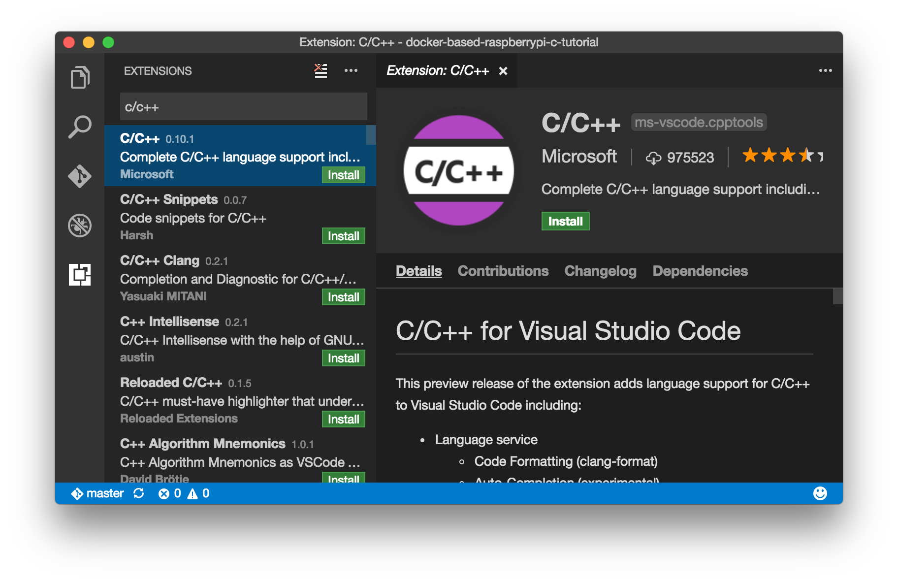
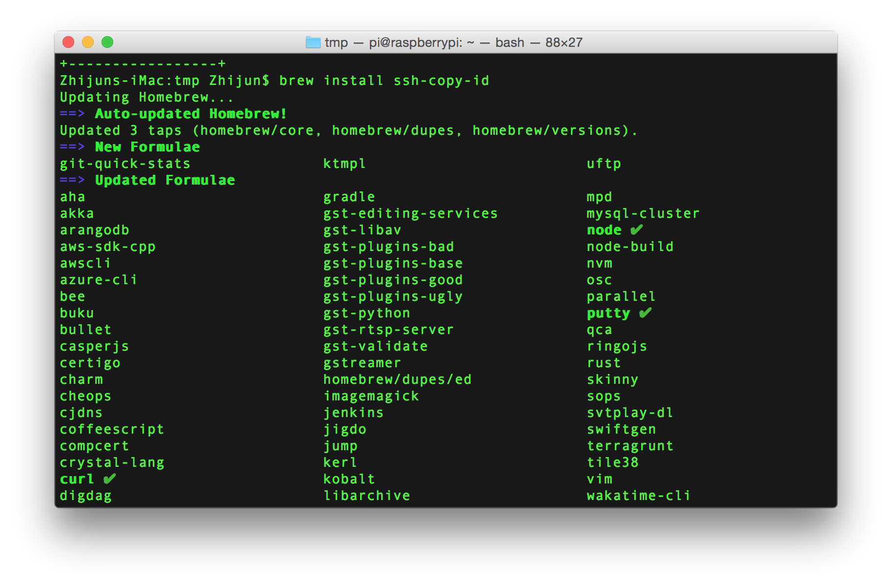
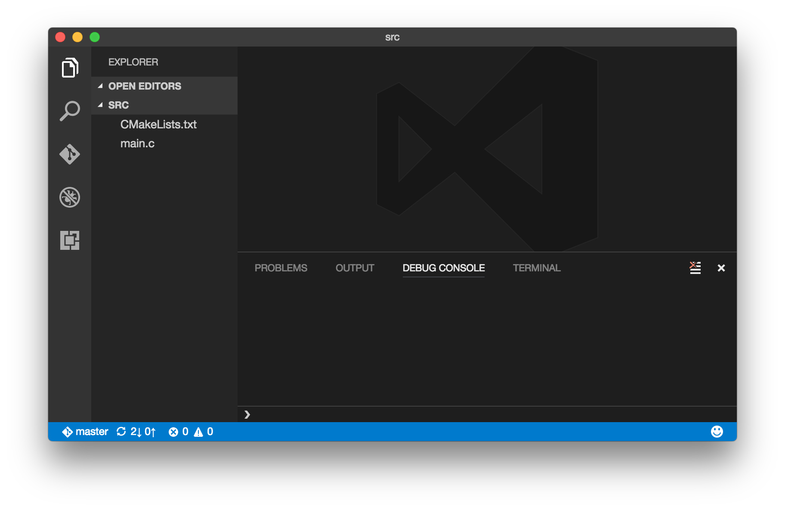
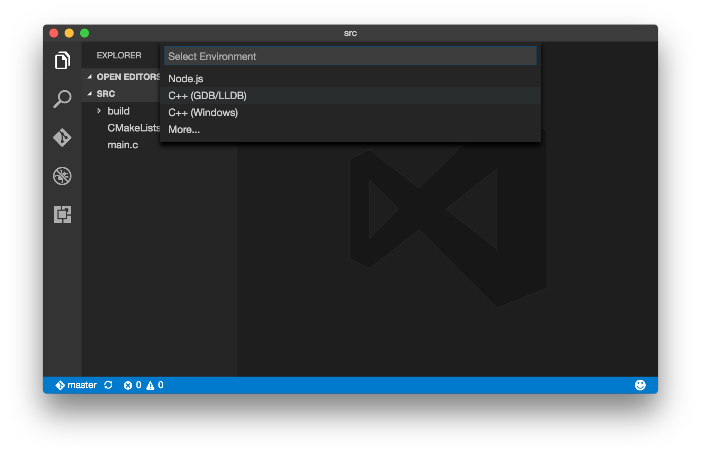
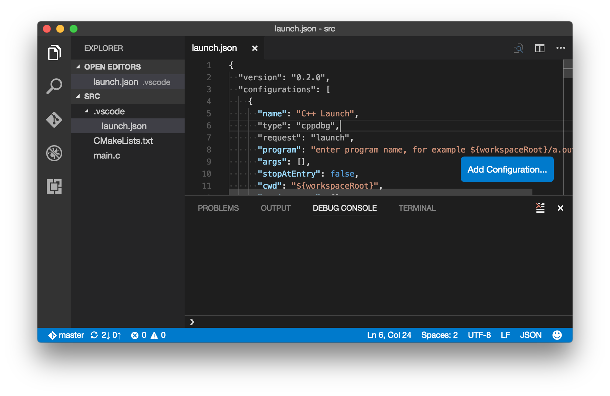
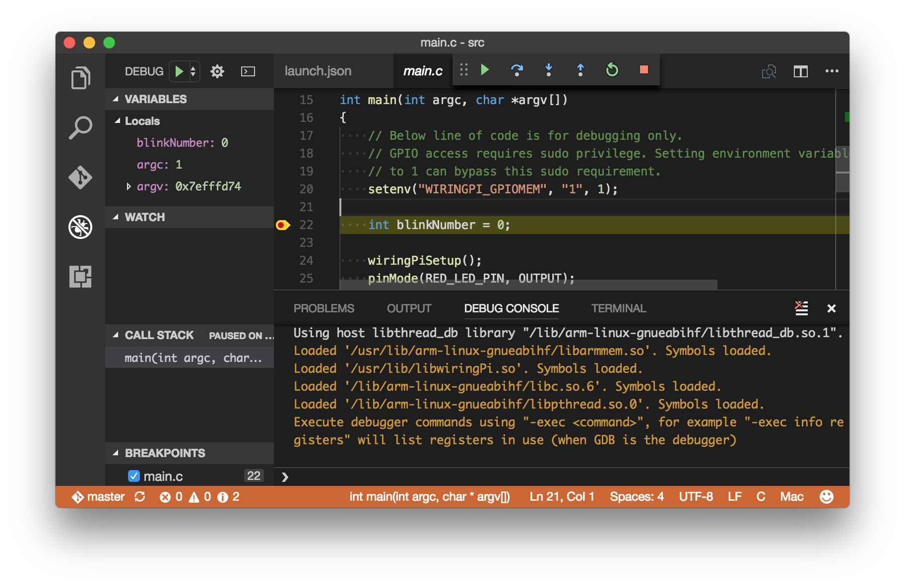

## Configure your device

Go to [Configure your device](https://docs.microsoft.com/en-us/azure/iot-hub/iot-hub-raspberry-pi-kit-c-lesson1-configure-your-device) page and setup your Pi for first-time use.

## Get the tools

### Install Git
To install Git, use the [Homebrew](http://brew.sh) package management utility by following these steps:

1. Install Homebrew. If you've already installed Homebrew, go to step 2.
   
   1. Press `Cmd + Space` and enter `Terminal` to open a terminal.
   2. Run the following command:
      
      ```bash
      /usr/bin/ruby -e "$(curl -fsSL https://raw.githubusercontent.com/Homebrew/install/master/install)"
      ```
2. Install Git by running the following command:
   
   ```bash
   brew install git
   ```

### Install Docker
Go to [Docker website](https://www.docker.com/). Scroll down and find the `Get Docker for Mac` link. Click it for download and installation.

## Build C code using Docker

1. Run below command to clone the repo.

   ```bash
   git clone https://github.com/Azure-Samples/docker-based-raspberrypi-c-tutorial.git
   cd docker-based-raspberrypi-c-tutorial
   ```

2. CMake is used for building the source code. We want all CMake files are placed in one standalone folder so that they won't mess up our existing code. Let's create the folder, say `build`.

   ```bash
   mkdir build
   ```

3. Run below commands to do the build. 

   ```bash
   docker pull zhijzhao/raspberrypi
   ```

   > Below `<>` part needs to be replace with your own value.

   ```bash
   docker run --rm -v </Users/user-name/some-path/docker-based-raspberrypi-c-tutorial>:/repo -it zhijzhao/raspberrypi /build.sh --outputdir build
   ```

   * `--rm` is a Docker running option. For details, please check [Docker reference](https://docs.docker.com/engine/reference/commandline/run/).
   * `</Users/user-name/some-path/docker-based-raspberrypi-c-tutorial>` is the full path of repo folder. Replace it with the repo path on your host machine.
   * `-v` option maps your repo folder to `/repo` folder of the Ubuntu OS running inside Docker container.
   * `-it` option allows you to interact with the running Docker container.
   * `zhijzhao/raspberrypi` is Docker image name. Reference `dockerfiles` folder if you're interested in how it works.
   * `/build.sh` is the shell script name inside the Ubuntu container that we want to run with `--outputdir build` parameter.


## Deploy and run the built app

1. Run below commands to deploy the contents of `src` folder to home folder of your Pi.

   ```bash
   docker pull zhijzhao/raspberrypi
   ```

   > Below `<>` parts need to be replace with your own values.

   ```bash
   docker run --rm -v </Users/user-name/some-path/docker-based-raspberrypi-c-tutorial>:/repo -it zhijzhao/raspberrypi /deploy.sh --deviceip <device ip address> --username <user name> --password <device password>
   ```

   * `</Users/user-name/some-path/docker-based-raspberrypi-c-tutorial/src>` should be replaced with your repo path, same as build step.
   * `--deviceip <device ip address> --username <user name> --password <device password>` includes IP address, user name and password credentials. Please replace them with your own accordingly.


3. Use SSH to log in the device and run the deployed app.

   ```bash
   ssh <user name>@<device ip address>
   sudo ./build/app
   ```


## Debug the app

1. Install Visual Studio Code

   * [Download](https://code.visualstudio.com/docs/setup/osx) and install Visual Studio Code. Visual Studio Code is a lightweight but powerful source code editor.

   * Open VS Code and install extension named `C/C++`. If you have already installed it, please make sure you're using the latest version.

      1. Type `code` command in your Terminal.
      2. In VS Code, press `Cmd + P` and type `ext install c/c++` as below.
      
      3. Click `Install` to install the exntension and reload VS Code as prompted. 
      


2. The `C/C++` extension needs a pipe program to communicate with a remote shell for remote debugging. Here we choose SSH. To avoid password input, we generate SSH key and upload it to Pi. 

   * Run `ssh-keygen` command in Terminal to generate SSH key.
   
   

   * Run `brew install ssh-copy-id` to get the SSH key upload tool.
   
   

   * Run `ssh-copy-id <user name>@<device IP address>` to upload the SSH key to device.

   

3. Run below command to open `src` folder with VS Code.

   ```bash
   code src
   ```

   

4. Generate `lanuch.json`.

   * Press `F5` key. VS Code will prompt for environment selection.

   

   * Choose `C++(GDB/LLDB)`. `launch.json` is generated automatically.

   

5. Config `launch.json`.

   * `program` is the full path of the deployed app on device. The built binary is at `./build/app` and by default it's deployed to device's `/home/pi` folder. So the full path value should be `/home/pi/build/app`.
 
   * `cwd` is the working folder on device and should be `/home/pi/src`.

   * `pipeTransport` is for authenticating pipe connection. Paste below properties to `launch.json` and update the user name and IP address accordingly.

      ```
      "pipeTransport": {
            "pipeCwd": "/usr/bin",
            "pipeProgram": "/usr/bin/ssh",
            "pipeArgs": [
                  "<user name>@<device ip address>"
            ],
            "debuggerPath": "/usr/bin/gdb"
      },
      ``` 

   * `sourceFileMap` is for mapping the path of where the code exists on the remote shell to where it is locally. Please add this property and update these two paths accordingly.

      ```
      "sourceFileMap": {
            // "remote": "local"
            "/home/pi/src": "</Users/user-name/some-path/docker-based-raspberrypi-c-tutorial/src>"
      },
      ```

   * `osx` specifies the debugger, which should be `gdb` instead of `lldb`. Simply replace its value with `Linux`'s.

   

6. Debug `main.c`.

   * Open `main.c` and insert breakpoints by pressing `F9` key.
   * Start debugging by pressing `F5` key. Code execution will stop at the breakpoint you set.
   * Press `F10` to debug step by step. Enjoy debugging!

   

## Contributing
This project has adopted the [Microsoft Open Source Code of Conduct](https://opensource.microsoft.com/codeofconduct/). For more information see the [Code of Conduct FAQ](https://opensource.microsoft.com/codeofconduct/faq/) or contact [opencode@microsoft.com](mailto:opencode@microsoft.com) with any additional questions or comments.
